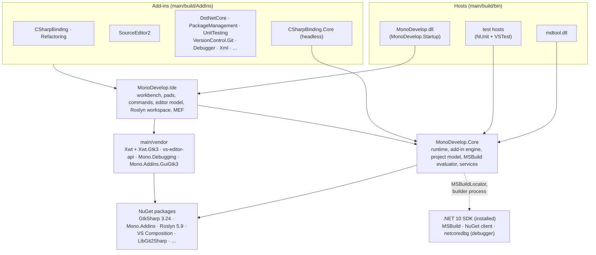

# Architecture

This page shows how MonoDevelop is put together after the Linux / .NET 10 migration: which layers
exist, how add-ins plug in, and what happens when you build, run, test and ship it. The decisions behind
each part are in [`docs/adr/`](adr/README.md).

## Layers

| Layer | Projects | Notes |
|---|---|---|
| Core | `main/src/core/MonoDevelop.Core` | Headless. Holds the runtime and service registry, logging, the Mono.Addins engine, the project and solution model (`.sln`/`.csproj`), the in-process MSBuild evaluator (`DefaultMSBuildEngine`), `DotNetCoreTargetRuntime` ([ADR 0007](adr/0007-dotnet-target-runtime.md)) and gettext ([ADR 0014](adr/0014-localization-ngettext.md)). |
| Builder | `main/src/core/MonoDevelop.Projects.Formats.MSBuild` (`MonoDevelop.MSBuildBuilder.dll`) | A separate process that runs real MSBuild builds and design-time builds ([ADR 0008](adr/0008-msbuild-hosting.md)). |
| IDE | `main/src/core/MonoDevelop.Ide` | The GTK 3 workbench (docking, pads, commands), the text editor abstraction and the VS editor API, the Roslyn workspace and MEF composition, and the theme ([ADR 0011](adr/0011-gtk3-port-strategy.md), [ADR 0012](adr/0012-text-editor.md)). |
| Hosts | `MonoDevelop.Startup` (the IDE executable `MonoDevelop.dll`), `src/tools/mdtool` | Framework-dependent `net10.0` executables, started with `dotnet <host>.dll`. |
| Add-ins | `main/src/addins/*` | One assembly, or a few, per feature, each with a `*.addin.xml` manifest. |
| Vendored forks | `main/vendor/*` | Forks with an `UPSTREAM.md` each ([ADR 0005](adr/0005-third-party-dependencies.md)): Xwt and its GTK 3 backend, the VS editor API subset, Mono.Debugging, and Mono.Addins.Gui on GTK 3. |

Code that is not part of the Linux build (the Mac and Windows platforms, legacy add-ins, Stetic) is still in
the repository but outside `main/MonoDevelop.Linux.sln` ([ADR 0017](adr/0017-linux-exclusions.md)).

## Add-in model

MonoDevelop is a set of Mono.Addins extension points. The engine is Mono.Addins 1.4 on CoreCLR, with every
add-in loaded in the default `AssemblyLoadContext` ([ADR 0006](adr/0006-mono-addins-on-coreclr.md)):

- `MonoDevelop.Core` and `MonoDevelop.Ide` declare extension points in their manifests, for example
  `/MonoDevelop/Core/Runtimes`, `/MonoDevelop/ProjectModel/MSBuildItemTypes`, `/MonoDevelop/Ide/Pads`,
  `/MonoDevelop/Ide/Commands` and `/MonoDevelop/Ide/Composition` (the assemblies scanned for MEF parts).
- Each add-in builds into `main/build/AddIns/<AddinBuildDir>`. References between add-ins are
  `Private=false`, so each assembly is shipped once. `scripts/check-assemblies.sh` rejects duplicates.
- A host finds its add-ins through a `*.addins` file next to it. The IDE scans all of `main/build/AddIns`.
  The headless hosts (`mdtool`, the Core test host) scan only `AddIns/MonoDevelop.CSharpBinding.Core`,
  which registers the C# project type without any GUI.
- Each host keeps its own add-in registry. Test hosts keep theirs under `main/tests/config/<host>`.
- Assemblies are resolved from the application directory
  (`AssemblyLoadContext.Default.Resolving`), and native libraries through the `NativeLibraryMap` module
  initializers, which replace Mono's `dllmap` ([ADR 0013](adr/0013-native-library-resolution.md)).

## How the IDE starts

1. `MonoDevelopMain.Main` registers the MSBuild of the newest installed .NET SDK
   (`MSBuildRegistration.EnsureRegistered`, Microsoft.Build.Locator) before any MSBuild type is loaded.
   It then calls `IdeStartup.Main`.
2. `IdeStartup` parses the options (`--smoke-test`, `-no-redirect`, files to open), initializes GTK 3 and Xwt
   (`ToolkitType.Gtk3`), applies the GTK theme (`GtkThemes`, `Name:dark` for dark variants) and starts
   `Runtime.Initialize`: logging, the add-in engine and the Core services.
3. The IDE services start: the desktop service from `GnomePlatform`, fonts, tasks, project operations, the
   workbench shell, and the type system with the Roslyn workspace and the MEF composition (cached under the
   profile's cache directory).
4. The main window appears. The user profile follows XDG: `$XDG_CONFIG_HOME/MonoDevelop/8.0`, plus the
   data and cache directories ([ADR 0021](adr/0021-versioning-and-release.md) explains why the product
   version stays 8.x).

## How a user project is loaded and built

- **Loading:** the solution and project files are read by MonoDevelop's own model. MSBuild evaluation
  (properties, items, globs, SDK imports resolved through the SDK's resolvers) runs **in process** in
  `DefaultMSBuildEngine`. That keeps project editing and saving format-preserving.
- **Building:** `RemoteBuildEngineManager` starts `MonoDevelop.MSBuildBuilder.dll` with `dotnet exec` and
  talks to it over a local TCP connection (`BinaryMessage`). The builder hosts the SDK's MSBuild
  (`BuildManager`), runs builds and design-time builds, and cancels them with
  `BuildManager.CancelAllSubmissions`. Remoting and BinaryFormatter are gone
  ([ADR 0009](adr/0009-remove-remoting-binaryformatter.md)).
- **C#:** `CSharpBinding.Core` registers the C# project type. `CSharpBinding` adds the editor
  features: Roslyn 5.9, with internal APIs reached through Krafs.Publicizer
  ([ADR 0010](adr/0010-roslyn-5-publicizer.md)). The IDE's Roslyn workspace gets the source files, analyzers and source
  generators of a project from a design-time run in the builder, and runs the generators itself
  ([ADR 0008](adr/0008-msbuild-hosting.md), [ADR 0025](adr/0025-source-generators-in-the-workspace.md)).
- **NuGet:** the NuGet add-in compiles against NuGet 7.9 and uses the SDK's NuGet assemblies at run time
  ([ADR 0020](adr/0020-nuget-client-version.md)).
- **Tests:** the UnitTesting add-in discovers and runs tests through VSTest
  (`Microsoft.TestPlatform.TranslationLayer`).
- **Debugging:** netcoredbg through the Debug Adapter Protocol
  ([ADR 0016](adr/0016-netcoredbg-debugging.md)).

`mdtool build <sln|csproj>` uses the same Core model and builder without a GUI.

## Build, test and CI

Everything runs inside the dev container through `./scripts/pm`. The container is built from
`Dockerfile`: .NET SDK 10, GTK 3, Xvfb, Weston, netcoredbg.

| Script | What it does |
|---|---|
| `scripts/build.sh` | Runs `dotnet build main/MonoDevelop.Linux.sln`. Warnings are errors, with per-project baselines ([ADR 0018](adr/0018-warning-policy.md)); `--check` also verifies the formatting of files this fork added. |
| `scripts/test.sh` | Runs `dotnet test`, one test assembly at a time, with `Category!=Quarantine`, coverlet coverage ([ADR 0015](adr/0015-test-framework.md)). GTK tests run under Xvfb. |
| `scripts/run.sh`, `scripts/debug.sh` | Run the IDE (or `mdtool`), optionally under netcoredbg. |
| `scripts/ci.sh` | The gate: setup, lint, build `--check`, duplicate-assembly check, tests, `NuGetAudit`, the mdtool smoke, and the GUI smoke tests on X11 (including Errors pad navigation) and Wayland. The budget is 900 s. |

`.github/workflows/ci.yml` runs `scripts/ci.sh` in the same image, and `release.yml` publishes a release from
`main` (ADR 0021). Dependencies are updated by hand; `NuGetAudit` and `scripts/audit.sh` flag vulnerable packages.

The IDE's `--smoke-test [sln|csproj]` option starts the IDE, opens and builds the solution, checks
Errors pad navigation when the build fails, and writes `ide.log` and `screenshot.png`.

## Where to look

| To change… | Start in |
|---|---|
| Project loading and saving, MSBuild evaluation | `MonoDevelop.Core/MonoDevelop.Projects.MSBuild` |
| Builds, the builder process | `MonoDevelop.Core/…/RemoteBuildEngineManager.cs`, `MonoDevelop.Projects.Formats.MSBuild` |
| Target frameworks and SDK discovery | `MonoDevelop.Core/MonoDevelop.Core.Assemblies` (`DotNetCoreTargetRuntime`, `MSBuildRegistration`) |
| Workbench, pads, docking | `MonoDevelop.Ide/MonoDevelop.Ide.Gui*`, `MonoDevelop.Ide/MonoDevelop.Components.Docking` |
| Themes and CSS | `MonoDevelop.Ide/MonoDevelop.Components/IdeTheme.cs`, `GtkThemes.cs`, `GtkCss.cs` |
| Text editor | `main/src/core/Mono.TextEditor.Shared` (shared project compiled into the SourceEditor2 add-in), `main/src/addins/MonoDevelop.SourceEditor2` |
| Start-up | `MonoDevelop.Startup`, `MonoDevelop.Ide/IdeStartup.cs` |
