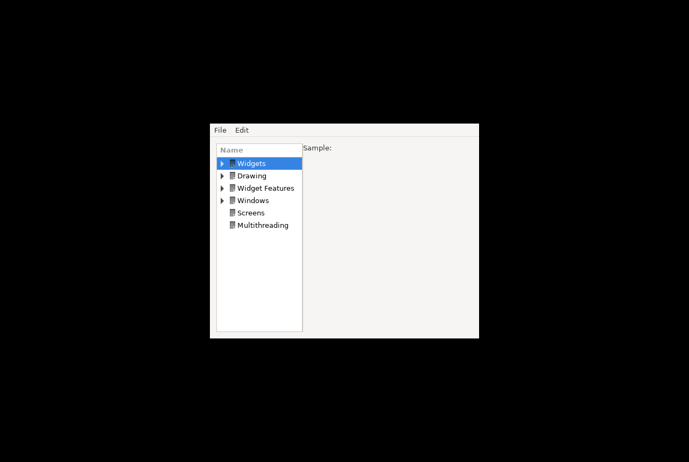

# M5 evidence — GUI on GTK3

## T066 — Xwt vendored, GTK3 backend on .NET 10 (WS-2)

Source: `main/vendor/xwt/` (upstream mono/xwt `9a22465b52`, MIT; local patches in
`main/vendor/xwt/UPSTREAM.md`). The `main/external/xwt` submodule is removed.

Commands (dev container):

```bash
./scripts/pm dotnet build main/MonoDevelop.Linux.sln
./scripts/pm bash -lc 'xvfb-run -a -s "-screen 0 1280x860x24" bash -c \
  "dotnet main/build/samples/xwt/Gtk3Test.dll & sleep 10; import -window root docs/evidence/M5/T066-xwt-gtk3-samples.png"'
```

Result (2026-09-23): the Xwt sample gallery (`TestApps/Gtk3Test` → `Samples`) starts on
`ToolkitType.Gtk3` with GtkSharp 3.24.24.95, SDK 10.0.401 and GTK 3.24.41. The window shows the menu bar,
the sample tree with the embedded icons, and the content pane. Nothing is written to stdout or stderr.
The process was stopped by the script after the screenshot (exit 143 = SIGTERM).



Not covered yet: interacting with each sample, and `WebView` (WebKitGTK 3.0 is not available; see
UPSTREAM.md "Known gaps").

## M5b: MonoDevelop.Ide compiles on GTK3 (2026-09-23)

At commit `65392553f7` the whole `MonoDevelop.Ide` project compiles against GtkSharp 3, Roslyn 5.9
and .NET 10 with no excluded sources: `Gtk3PortPending.props` (900 of 1242 files at its peak) is gone.
The strict solution build (`dotnet build main/MonoDevelop.Linux.sln`, warnings as errors with the
per-project baselines) has 0 errors. `./scripts/test.sh`: MonoDevelop.Core.Tests 1065 passed /
9 skipped, MonoDevelop.Ide.Gtk3.Tests 25 passed.

GTK2-only APIs in the sources compiled by the Linux solution
([inventory-linux-sln.md](inventory-linux-sln.md), `./scripts/inventory.sh --linux-sln`):

| Pattern | Files |
|---|---|
| `ExposeEvent` (event, override, args) | 0 |
| `SizeRequested` (event, override, args) | 0 |
| `Gdk.GC` / `Gdk.Drawable` | 0 |
| `Gtk.Rc` (RC theming) | 0 (was 5; GTK 3 themes and per-widget CSS, see below) |

Compiling is not running: the IDE has not been started yet (M5c). Legacy code came back with 48 more
warning IDs on the Ide baseline and with 0.42% line coverage, which lowered the product total from
46.77% to 17.19% (ADR 0015 amendment).

### GTK 3 themes (T082, T083)

GTK 2 RC theming is gone from the Linux build. `GtkThemes` lists the GTK 3 themes of the XDG theme
directories (`<dir>/themes/<Name>/gtk-3.*/gtk.css`) plus the ones built into GTK (Adwaita,
HighContrast), and offers a theme's dark variant (`gtk-dark.css`) as `Name:dark`, the GTK_THEME syntax,
applied with `gtk-application-prefer-dark-theme`. Per-widget RC styles (tab close button, tree expander
size, compact scrolled window, paned handles) are CSS providers on the widget (`GtkCss`). The bundled
GTK 2 gtkrc themes (Xamarin engine, Mac, Windows) are no longer used. Tests: `GtkThemesTests`
(discovery, dark variants, applying a theme, a CSS style property set/replaced/removed on a real
widget). Screenshots of the IDE in a light and a dark theme wait for the IDE to start (M5c), so T083
stays open.
