# M5 evidence — GUI on GTK3

## T066 — Xwt vendored, GTK3 backend on .NET 10 (WS-2)

Source: `main/vendor/xwt/` (upstream mono/xwt `9a22465b52`, MIT; local patches in
`main/vendor/xwt/UPSTREAM.md`). The `main/external/xwt` submodule is removed.

Commands (dev container):

```bash
./scripts/pm dotnet build main/MonoDevelop.Linux.sln
./scripts/pm bash -lc 'xvfb-run -a -s "-screen 0 1280x860x24" bash -c \
  "dotnet main/build/samples/xwt/Gtk3Test.dll & sleep 10; import -window root docs/evidence/M5/T066-xwt-gtk3-samples.png"'
```

Result (2026-09-23): the Xwt sample gallery (`TestApps/Gtk3Test` → `Samples`) starts on
`ToolkitType.Gtk3` with GtkSharp 3.24.24.95, SDK 10.0.401 and GTK 3.24.41. The window shows the menu bar,
the sample tree with the embedded icons, and the content pane. Nothing is written to stdout or stderr.
The process was stopped by the script after the screenshot (exit 143 = SIGTERM).


Not covered yet: interacting with each sample, and `WebView` (WebKitGTK 3.0 is not available; see
UPSTREAM.md "Known gaps").

## M5b: MonoDevelop.Ide compiles on GTK3 (2026-09-23)

At commit `65392553f7` the whole `MonoDevelop.Ide` project compiles against GtkSharp 3, Roslyn 5.9
and .NET 10 with no excluded sources: `Gtk3PortPending.props` (900 of 1242 files at its peak) is gone.
The strict solution build (`dotnet build main/MonoDevelop.Linux.sln`, warnings as errors with the
per-project baselines) has 0 errors. `./scripts/test.sh`: MonoDevelop.Core.Tests 1065 passed /
9 skipped, MonoDevelop.Ide.Gtk3.Tests 25 passed.

GTK2-only APIs in the sources compiled by the Linux solution
([inventory-linux-sln.md](inventory-linux-sln.md), `./scripts/inventory.sh --linux-sln`):

| Pattern | Files |
|---|---|
| `ExposeEvent` (event, override, args) | 0 |
| `SizeRequested` (event, override, args) | 0 |
| `Gdk.GC` / `Gdk.Drawable` | 0 |
| `Gtk.Rc` (RC theming) | 0 (was 5; GTK 3 themes and per-widget CSS, see below) |

Compiling is not running: the IDE has not been started yet (M5c). Legacy code came back with 48 more
warning IDs on the Ide baseline and with 0.42% line coverage, which lowered the product total from
46.77% to 17.19% (ADR 0015 amendment).

### GTK 3 themes (T082, T083)

GTK 2 RC theming is gone from the Linux build. `GtkThemes` lists the GTK 3 themes of the XDG theme
directories (`<dir>/themes/<Name>/gtk-3.*/gtk.css`) plus the ones built into GTK (Adwaita,
HighContrast), and offers a theme's dark variant (`gtk-dark.css`) as `Name:dark`, the GTK_THEME syntax,
applied with `gtk-application-prefer-dark-theme`. Per-widget RC styles (tab close button, tree expander
size, compact scrolled window, paned handles) are CSS providers on the widget (`GtkCss`). The bundled
GTK 2 gtkrc themes (Xamarin engine, Mac, Windows) are no longer used. Tests: `GtkThemesTests`
(discovery, dark variants, applying a theme, a CSS style property set/replaced/removed on a real
widget).

T083 screenshots (2026-09-24, M5c): the smoke test on `Broken` under Xvfb, once with no theme preference
(the default GTK theme) and once with `MonoDevelop.Ide.UserInterfaceTheme` = `Adwaita:dark` in
`MonoDevelopProperties.xml`. The log says `GTK: Using Gtk theme Adwaita:dark`. The IDE then detects the
dark background, and the editor switches to its dark colour scheme.

| Light | Dark |
|---|---|
| 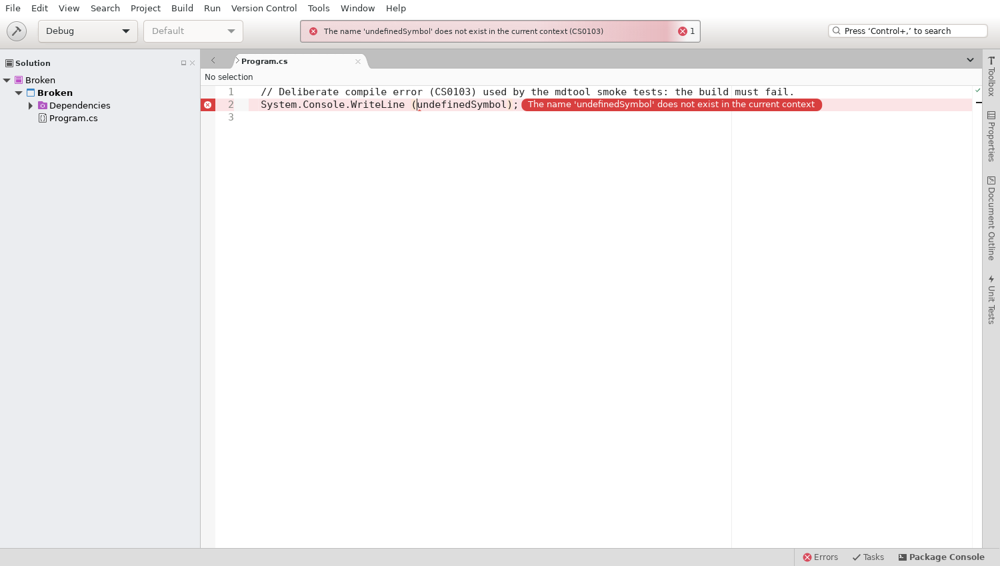 | 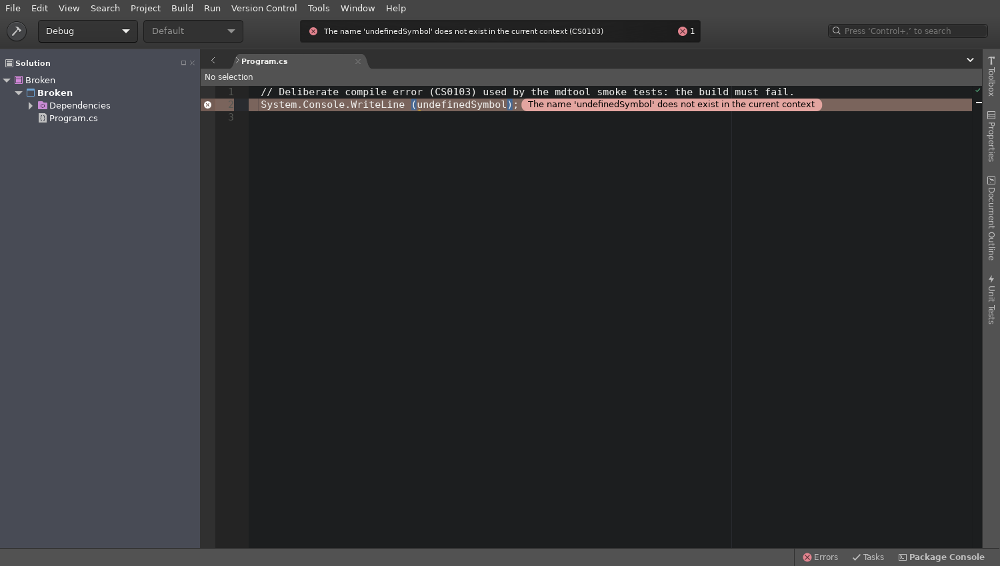 |

## M5c: the IDE runs (2026-09-23)

- **Start-up (T086, T087):** `dotnet main/build/bin/MonoDevelop.dll` reaches the main window and the
  Welcome page on GTK 3 / .NET 10 ([T086-ide-welcome.png](T086-ide-welcome.png)) with Core, Ide,
  GnomePlatform, Debugger and DesignerSupport add-ins and no errors in the log. Main window about 1.6 to
  3.7 s after the process starts (Xvfb, warm caches).
- **Smoke test (T103):** `MonoDevelop.dll --smoke-test [solution]` opens and builds a solution and exits
  0/1/2 (checked: Smoke.sln 0, Broken.csproj 1, a 2 s watchdog 2). X11: [T103-smoke-x11.png](T103-smoke-x11.png).
- **Wayland (T104):** the same smoke on headless Weston, `GDK_BACKEND=wayland`:
  [T104-smoke-wayland.png](T104-smoke-wayland.png) (retaken in T109: the first image was blank). Both run in `scripts/ci.sh`.
- Not yet: C# editing features (T089) and the other add-ins.

## T085, T088 — the source editor on GTK 3 (M5c)

`MonoDevelop.SourceEditor2` (with the `Mono.TextEditor.Shared` document model) is SDK-style net10.0 on
GtkSharp 3.24.24.95; `MonoDevelop.SourceEditor.dll.config` is deleted (P/Invokes resolve through
`NativeLibraryMap`, `SourceEditorNativeLibraries`).

Commands (dev container):

```bash
./scripts/pm dotnet build main/MonoDevelop.Linux.sln
./scripts/pm bash -lc 'xvfb-run -a -s "-screen 0 1600x1000x24" bash -c "dotnet main/build/bin/MonoDevelop.dll \
  -no-redirect main/tests/linux-smoke/Hello/Program.cs > out/ide.log 2>&1 & sleep 60; import -window root out/ide.png; kill %1"'
./scripts/pm ./scripts/test.sh --no-build
```

Result (2026-09-24): the IDE opens `Program.cs` in the source editor: line numbers, caret, syntax highlighting
(the string literal) and the quick task strip ([T088-editor.png](T088-editor.png)); a larger file shows
comments and keywords highlighted and the text area filling the document view
([T088-editor-highlighting.png](T088-editor-highlighting.png)). `out/ide.log` has no ERROR/FATAL line; the only
MEF composition error left is Roslyn's Pythia signature help provider (external access, not used).

The editor platform services that upstream came from the closed-source VS editor
(`Microsoft.VisualStudio.Platform.VSEditor`) are exported by SourceEditor2 (ISmartIndentationService,
IToolTipService, IViewElementFactoryService, IIntellisenseSessionStackMapService, ISignatureHelpBroker) or added
in `VSEditor/EditorPlatformServices.cs` (ILoggingServiceInternal, IObscuringTipManager, the `BraceCompletion/Enabled`
option definition).

Tests: `MonoDevelop.TextEditor.Tests` (the legacy Mono.TextEditor suite, converted) 289 passed, 12 skipped
(legacy `[Ignore]`), 16 quarantined ([quarantine.md](../M4/quarantine.md)); `MonoDevelop.Ide.Gtk3.Tests`
`SourceEditorTests` (editor MEF exports, text area in a GTK 3 scrolled window rendering a document offscreen
within the clip it is given, typing).

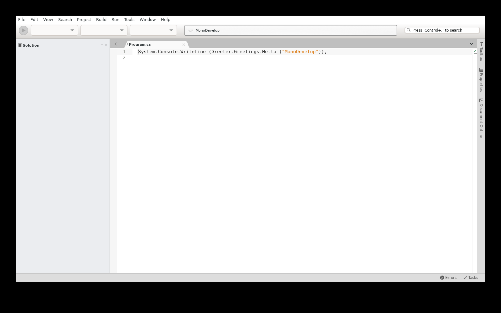

## T089, T090 — the C# binding and Refactoring add-ins on Roslyn 5.9 (M5c)

`MonoDevelop.Refactoring` and `CSharpBinding` are SDK-style net10.0 add-ins on GTK 3 and Roslyn 5.9 (Publicizer),
without Roslyn EditorFeatures (ADR 0010 amendment), NRefactory (ADR 0019), MonoDevelop.UnitTesting (T101) or the
Cocoa/WPF TextEditor add-in (ADR 0012). CSharpBinding depends on the CSharpBinding.Core add-in and builds to
`AddIns/CSharpBinding`. Excluded sources are listed with their reason in each csproj; removed features in
`docs/BREAKING-CHANGES.md`.

Commands (dev container):

```bash
./scripts/pm dotnet build main/MonoDevelop.Linux.sln
./scripts/pm bash -lc 'xvfb-run -a -s "-screen 0 1600x1000x24" bash -c "dotnet main/build/bin/MonoDevelop.dll -no-redirect \
  main/tests/linux-smoke/Smoke.sln main/tests/linux-smoke/Hello/Program.cs > out/ide.log 2>&1 & sleep 60; import -window root out/ide.png; kill %1"'
./scripts/pm ./scripts/test.sh --no-build
```

Result (2026-09-24): the IDE loads the Refactoring, CSharpBinding.Core and CSharpBinding add-ins; the Solution pad
shows the C# project icons; `Program.cs` has Roslyn semantic highlighting (class names, string literal) and the quick
task strip reports no errors ([T089-csharp.png](T089-csharp.png)). `out/ide.log` has no ERROR/FATAL line from these
add-ins (the only ERROR lines, also without them, are the core MSBuild evaluator failing on the SDK 10.0.401
property `_MSBuildVersionMajorMinor`).

Tests: `MonoDevelop.Ide.Gtk3.Tests` `CSharpBindingTests` — completion after `System.Console.` offers `WriteLine`
(US3-2), formatting of a document and on `;` without EditorFeatures, the lexer that replaces NRefactory's; 48 passed.
`MonoDevelop.Refactoring.Tests` (NUnit 3; the three legacy files wait for IdeUnitTests, T107) — host analyzers as
solution analyzer references give the compiler errors through `IDiagnosticAnalyzerService`, are added again when the
solution is replaced, and the code action progress tracker; 4 passed.

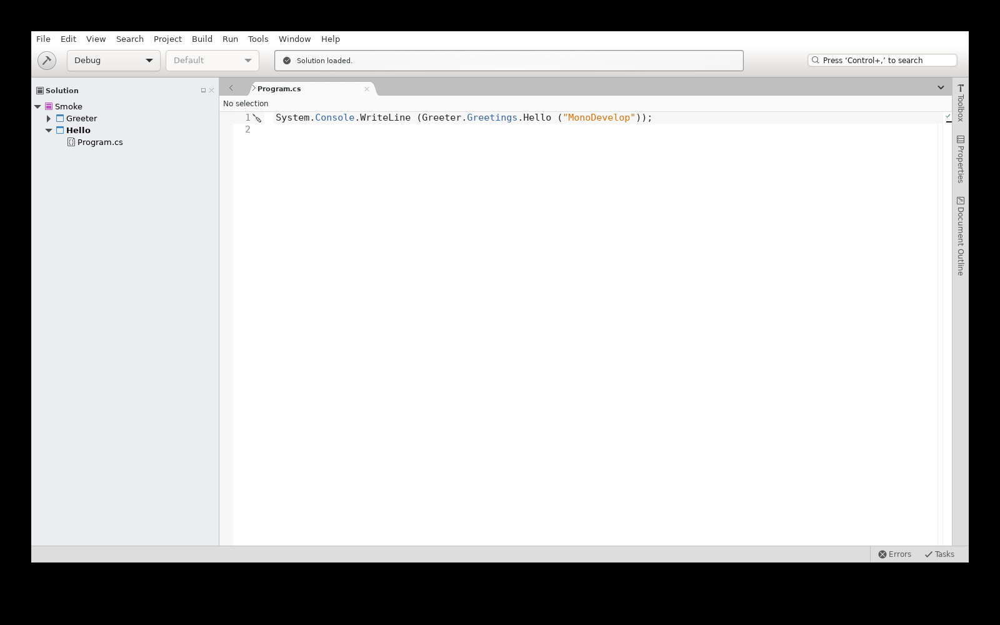

## T100 — ADR 0020 NuGet client 7.9 and the NuGet add-in (M5c)

`MonoDevelop.PackageManagement` is an SDK-style net10.0 add-in on GTK 3 and the NuGet 7.9 client
([ADR 0020](../../adr/0020-nuget-client-version.md)): the NuGet assemblies the .NET SDK carries are compile-only in every
project (`main/msbuild/Linux/Common.targets`) and load from the SDK at run time, the same ones MSBuild's
`NuGetSdkResolver` uses; the add-in ships `NuGet.PackageManagement`, `NuGet.Resolver` and `Microsoft.Web.XmlTransform`.
`MonoDevelop.Refactoring`'s `PackageInstaller` services are compiled again, on Roslyn 5.9's `IPackageInstallerService` /
`ISymbolSearchService`. Excluded sources and API changes are listed in the csproj files and the ADR; removed features in
`docs/BREAKING-CHANGES.md`.

Commands (dev container):

```bash
./scripts/pm dotnet build main/MonoDevelop.Linux.sln
./scripts/pm ./scripts/check-assemblies.sh
./scripts/pm bash -lc 'xvfb-run -a -s "-screen 0 1600x1000x24" dotnet test \
  main/src/addins/MonoDevelop.PackageManagement/MonoDevelop.PackageManagement.Tests/MonoDevelop.PackageManagement.Tests.csproj'
./scripts/pm bash -lc 'xvfb-run -a -s "-screen 0 1600x1000x24" bash -c "dotnet main/build/bin/MonoDevelop.dll -no-redirect \
  main/tests/linux-smoke/Smoke.sln > out/ide.log 2>&1 & sleep 70; import -window root out/ide.png; kill %1"'
```

Result (2026-09-24): `main/build/bin` has no NuGet assembly and its `MonoDevelop.deps.json` no NuGet runtime asset;
`check-assemblies.sh` finds no duplicate. The IDE loads the add-in, restores the smoke solution on opening ("Packages
successfully restored", [T100-nuget.png](T100-nuget.png)), and `out/ide.log` no longer has the
`The SDK resolver type "NuGetSdkResolver" failed to load … NuGet.Common, Version=7.9.0.0` warning.

Tests: `MonoDevelop.PackageManagement.Tests` (NUnit 3) 704 passed, 3 skipped (legacy `[Ignore]`), 1 quarantined
(nuget.org, [quarantine.md](../M4/quarantine.md)); 10 legacy fixtures that restore .NET Framework / Xamarin samples from
nuget.org through `IdeTestBase` (T107) are not compiled. FR-010: `PackageOperationsEndToEndTests` adds (1.0.0), updates
(2.0.0), restores (assets file and extracted package deleted) and removes a package in a copy of
`tests/linux-smoke` through the add-in's package actions, with a local folder feed and global packages folder created by
the test, and resolves an MSBuild project SDK from that feed with the in-process `NuGetSdkResolver`.

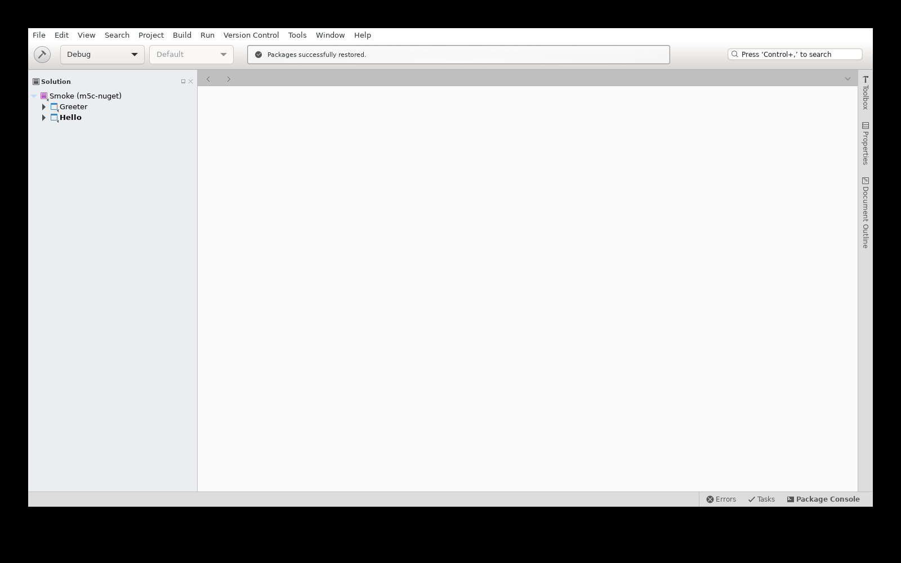

## T093, T095, T096, T098 — Assembly browser, hex editor, DocFood and Gettext add-ins (M5c)

`MonoDevelop.AssemblyBrowser`, `MonoDevelop.HexEditor`, `MonoDevelop.DocFood` and `MonoDevelop.Gettext` are SDK-style
net10.0 add-ins on GTK 3, in their MonoDevelop 8.6 folders (`AddIns/DisplayBindings/{AssemblyBrowser,HexEditor,Gettext}`,
`AddIns/BackendBindings`). Stetic output is frozen; DocFood's and HexEditor's `gui.stetic` are deleted (HexEditor's
Stetic project had no widgets and was never compiled).

- The assembly browser decompiles with ICSharpCode.Decompiler 11.1.0.9782 from nuget.org (metadata based, no
  Mono.Cecil; upstream got 5.0 transitively from Roslyn EditorFeatures), copied next to the add-in. It never used
  NRefactory; the MonoDoc lookup (`HelpExtensions.cs`, no callers) is not compiled. Decompilations of one assembly
  are serialized (`CSharpDecompiler` keeps its syntax tree in a field: selecting nodes quickly mixed two outputs).
- Gettext no longer depends on the Autotools and Deployment add-ins (ADR 0017): `MakefileHandler.cs` is not compiled,
  the `IDeployable` part of `TranslationProject` is behind `GETTEXT_DEPLOYMENT`, and the GTK 2 GtkSpell binding (its
  callers were commented out upstream) is not compiled. The catalog editor's text editors are hosted in frames
  (GTK 3 would wrap them in viewports) and entry colors are CSS (`Gtk3BaseColor`). The add-in stays off by default.
- Outside these projects: the source editor's scroll bar overview no longer creates a cairo context of the IDE
  window on Linux (it was unused there, and disposing it made GTK lose references of the window: the IDE crashed when
  the Gettext catalog editor opened); the vs-editor-api `Strings.resx` resources keep the manifest names their
  generated classes look up (an undo transaction for a text change set outside of one logged a missing resource).

Commands (dev container; a scratch profile with the Gettext add-in enabled, temporary start-up handlers opened the
assembly browser on `System.Console` in C# and `Xwt.dll` in the hex editor for the screenshots):

```bash
./scripts/pm dotnet build main/MonoDevelop.Linux.sln
./scripts/pm bash -lc 'xvfb-run -a -s "-screen 0 1600x1000x24" bash -c "dotnet main/build/bin/MonoDevelop.dll -no-redirect \
  main/tests/linux-smoke/Smoke.sln > out/ide.log 2>&1 & sleep 70; import -window root out/ide.png; kill %1"'
./scripts/pm ./scripts/ci.sh
```

Result (2026-09-24): the IDE loads the AssemblyBrowser and DocFood add-ins at start (HexEditor loads when a file is
opened in it, Gettext when enabled) and `out/ide.log` has no ERROR/FATAL line. The assembly browser shows
`System.Console` decompiled to C# ([T093-assembly-browser.png](T093-assembly-browser.png)), the hex editor `Xwt.dll`
([T095-hex-editor.png](T095-hex-editor.png)) and the Gettext catalog editor a PO file with a valid, a fuzzy and a
missing translation ([T098-gettext-po-editor.png](T098-gettext-po-editor.png)). DocFood's options panels are
commented out in its manifest upstream; its editor extension and documentation generator load with the add-in.

Tests (`MonoDevelop.Ide.Gtk3.Tests`, 64 passed): `AssemblyBrowserTests` (System.Console decompiled to C# with member
links, and disassembled to IL), `GettextTests` (a PO catalog read, changed and written back; the CSS base color of an
entry), `TextEditorOverviewTests` (an embedded editor redraws its overview after an options change),
`EditorResourcesTests` (the string resources of the 11 vs-editor-api assemblies are found). `./scripts/ci.sh`: every
step passes except `gui-smoke`, which fails the same way on an unmodified build of `1fefbbab95` (the IDE reports one
build error for Smoke.sln with no message while `mdtool build` and `dotnet build` succeed).

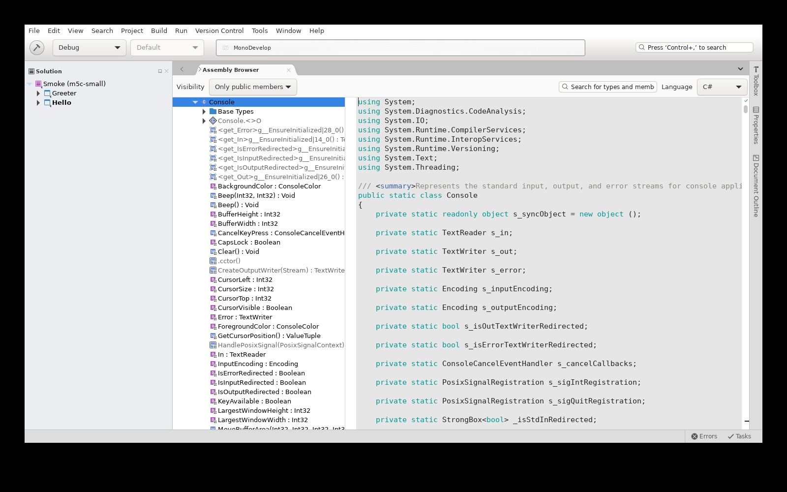
## T101 — Unit testing add-in on VSTest (M5c, FR-011)

`MonoDevelop.UnitTesting` is an SDK-style net10.0 add-in on GTK 3. Its VSTest integration drives the
`vstest.console.dll` of the .NET SDK the IDE uses (the one `dotnet test` runs) in design mode through the VSTest client
(`Microsoft.TestPlatform.TranslationLayer` 18.10.1, `VsTestConsoleWrapper`, synchronous API on a worker thread): one
vstest.console for discovery and one for runs; the test host is started by the IDE's execution handler (custom test
host launch), so its output goes to the IDE console. The legacy add-in hosted the design-mode socket itself and ran the
.NET Framework `vstest.console.exe` of the `Microsoft.TestPlatform` package with Mono. The legacy NUnit runner add-in
(`MonoDevelop.UnitTesting.NUnit`: Mono runner processes; its NUnit test suites are not created for .NET Core projects)
and the empty `MonoDevelop.UnitTesting.NUnit.Runners` project are not built; the NUnit, xUnit and MSTest editor test
markers are in the UnitTesting manifest, and CSharpBinding's `UnitTestTextEditorExtension` and
`CSharpNUnitSourceCodeLocationFinder` are compiled again.

## T099 — the .NET Core add-in (M5c)

`MonoDevelop.DotNetCore` is an SDK-style net10.0 add-in on GTK 3. SDK discovery uses Core's
`DotNetCoreTargetRuntime` / `DotNetCoreSdkInfo`: the add-in's `DotNetCorePath` takes the host Core uses (with links
resolved) instead of `/usr/share/dotnet/dotnet`, and the Mono-only `MSBuildSdks` / `MSBuildSdksPathGlobalPropertyProvider`
are not compiled. SDKs of .NET 5 and later are supported, `global.json` `rollForward` policies are honoured (the
repository's `10.0.100` + `latestFeature` selects SDK 10.0.401), and the New Project dialog lists the console, library
and test templates of the installed SDK (`dotnet/templates/10.0.*`). The Dependencies folder reads the package graph
from `obj/project.assets.json` (SDK 5+ design-time builds return top-level packages only): frameworks, NuGet packages
with their dependencies and restore warnings, and project references. The add-in ships no NuGet assembly (only
`MonoDevelop.DotNetCore.dll` in `build/AddIns/MonoDevelop.DotNetCore`).

Commands (dev container):

```bash
./scripts/pm dotnet build main/MonoDevelop.Linux.sln
./scripts/pm bash -lc 'xvfb-run -a -s "-screen 0 1600x1000x24" dotnet test \
  main/src/addins/MonoDevelop.UnitTesting/MonoDevelop.UnitTesting.Tests/MonoDevelop.UnitTesting.Tests.csproj'
```

Tests: `MonoDevelop.UnitTesting.Tests` (NUnit 3) 19 passed. FR-011: `VsTestEndToEndTests` copies
`tests/unittesting-samples` (NUnit 3.14, xUnit 2.9.3 and MSTest 4.4.1 projects, one passing and one failing test each),
restores it with no package source (the packages come from the global packages folder, filled by the `PackageDownload`
items of the test project during the solution restore), loads and builds it with the project model, creates the test
tree with `UnitTestService.BuildTest` (the add-in's VSTest provider), discovers `AdditionPasses` / `AdditionFails` and
runs the project (1 passed, 1 failed) and the failing test alone, per framework.

In the IDE (Xvfb), the samples solution: Run all tests in the Unit Tests pad builds, discovers and runs the three
projects; the Test Results pad lists 3 passed and 3 failed tests
([T101-unittesting.png](T101-unittesting.png), [T101-test-results.png](T101-test-results.png)).

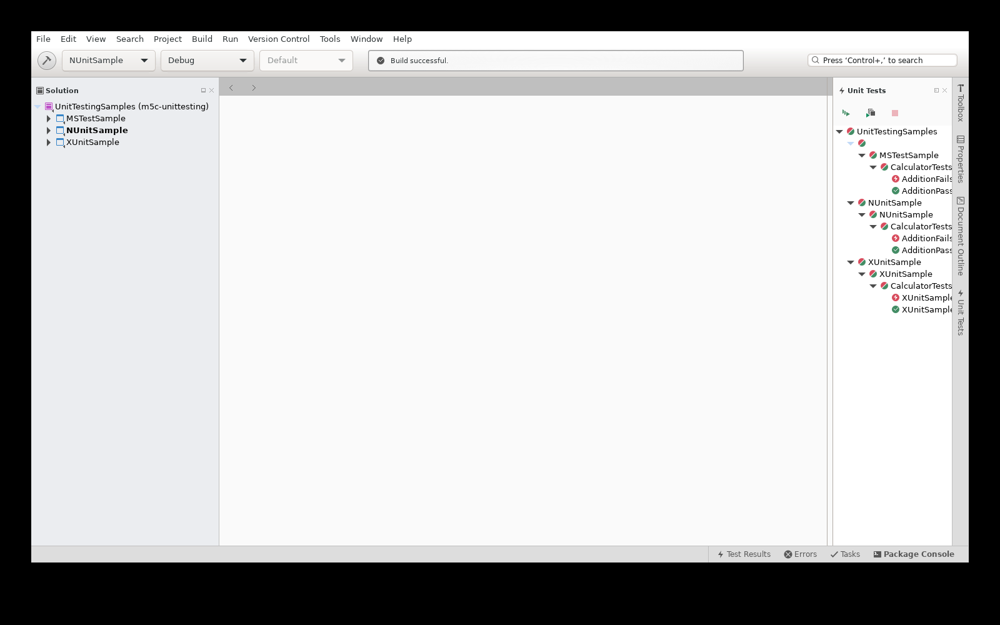

  main/src/addins/MonoDevelop.DotNetCore/MonoDevelop.DotNetCore.Tests/MonoDevelop.DotNetCore.Tests.csproj'
# a copy of tests/linux-smoke whose Hello project references Moq, restored, with the Dependencies node expanded in
# .vs/Smoke/xs/UserPrefs.xml
./scripts/pm bash -lc 'xvfb-run -a -s "-screen 0 1600x1000x24" bash -c "dotnet main/build/bin/MonoDevelop.dll -no-redirect \
  out/ide-deps/Smoke.sln > out/ide.log 2>&1 & sleep 90; import -window root out/ide.png; kill %1"'
```

Result (2026-09-24): the IDE loads the add-in with no error in `out/ide.log`; the Dependencies node of Hello shows
Frameworks (Microsoft.NETCore.App), NuGet (Moq 4.20.72, with the NU1603 restore warning of its Castle.Core
dependency) and Projects (Greeter) ([T099-dotnetcore.png](T099-dotnetcore.png)).

Tests: `MonoDevelop.DotNetCore.Tests` (NUnit 3) 256 run outside quarantine: 251 passed, 5 skipped (legacy `[Ignore]`
and .NET Core 3 SDK checks); 13 quarantined (11 restore from nuget.org, a PCL fixture, a Web SDK change;
[quarantine.md](../M4/quarantine.md)). `DependenciesNodeSdkProjectTests` restores a net10.0 project from a local feed
and checks the Dependencies folder; `DotNetCoreSdkTemplatesTests` finds the SDK 10 templates in the templating service.
The .NET Core 1.x-3.1 template tests (`DotNetCoreProjectTemplateTests`, `IdeUnitTests`, nuget.org) are not compiled (T107).

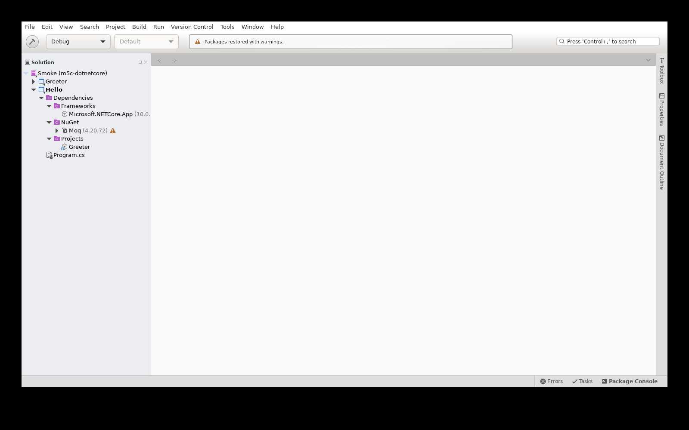

## T105 — Errors pad navigation (M5c, US3-3)

When the build has errors, `--smoke-test` activates the first row of the Errors pad the way a
double-click does (`ErrorListPad.ActivateFirstRow`). It then checks that the editor opens the file of that
error with the caret on its line; if not, the exit code is 2. The CI step `gui-smoke-errors` runs it on
`main/tests/linux-smoke/Broken` and expects exit code 1 and this log line:

```
Smoke test: build finished with 1 errors, 0 warnings
Smoke test: build error /tmp/tmp.IsBKlzyLTi/Broken/Program.cs(2,27): CS0103 The name 'undefinedSymbol' does not exist in the current context
Smoke test: error list navigation opened Program.cs at line 2
Smoke test: exit code 1 (1 build errors) after 10.4 s
```

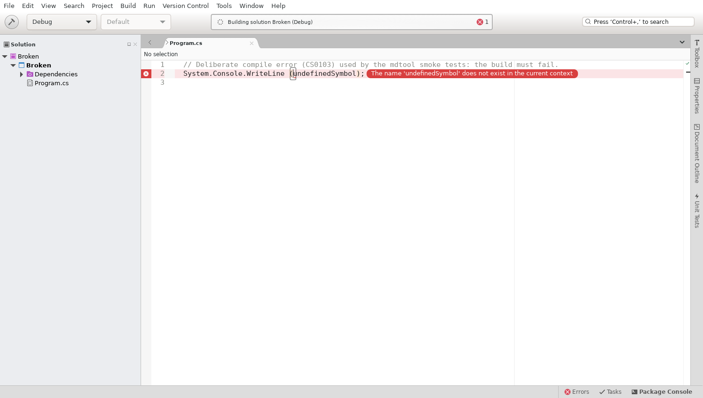

## T112–T114 — debugging with netcoredbg (M5c, US4)

**T112.** New add-in `main/src/addins/MonoDevelop.Debugger.NetCoreDbg` (ADR 0016 amendment). It registers the
engine `MonoDevelop.Debugger.NetCoreDbg` (".NET Debugger (netcoredbg)") on `/MonoDevelop/Debugging/DebuggerEngines`.
The engine takes `dotnet <program>.dll` commands, which are the execution commands of .NET SDK projects.
`NetCoreDbgSession : VSCodeDebuggerSession` starts `netcoredbg --interpreter=vscode`, found through the
`MonoDevelop.Debugger.NetCoreDbg.Path` property or on `PATH`. Engine and session are based on the DotDevelop
netcoredbg add-in (MIT). The DAP client needed four fixes:

- breakpoints are sent before `configurationDone`;
- the `process` event is recorded on the protocol thread, and the cached process list is reset (new
  `DebuggerSession.ResetProcesses` in the vendored Mono.Debugging);
- `entry` stops are handled;
- the Debugger.VsCodeDebugProtocol add-in imports the protocol assembly. Without it, the IDE failed with
  `FileNotFoundException: Microsoft.VisualStudio.Shared.VSCodeDebugProtocol` when the session was created.

**T113.** `MonoDevelop.Debugger.Tests` is converted to SDK style and is in the solution (folder `tests`), so
`scripts/test.sh` runs it. `NetCoreDbgTests` builds a net10.0 console fixture in a temporary directory once. Then it
checks these steps over DAP:

- the breakpoint is hit (same `Breakpoint` object, file, line);
- locals `first=20`, `second=22`, `sum=0`;
- step over reaches the next line, where `sum=42`;
- continue ends with exit code 3, and the output contains `sum=42`;
- an unhandled exception stops at the `throw` line.

The other tests cover the engine's command parsing, the launch arguments, the `PATH` lookup, and
`DebuggingService` listing the engine. `MonoDevelop.DotNetCore.Tests` gets `NetCoreDbgEngineTests`: it loads the
`dotnetcore-sdk-console` sample, creates its `DotNetCoreExecutionCommand`, and checks that `DebuggingService`
chooses the netcoredbg engine and that the program is `dotnetcore-sdk-console.dll`.

```bash
./scripts/pm bash -lc 'xvfb-run -a dotnet test main/src/addins/MonoDevelop.Debugger/MonoDevelop.Debugger.Tests/MonoDevelop.Debugger.Tests.csproj --filter FullyQualifiedName~NetCoreDbg'
  Passed EngineDebugsDotnetProgramCommands [9 ms]
  Passed EngineIsListedByDebuggingService [85 ms]
  Passed LocatorFindsTheAdapterOnPath [< 1 ms]
  Passed SessionBreakpointLocalsStepOverAndExitCode [383 ms]
  Passed SessionLaunchProperties [1 ms]
  Passed SessionStopsOnUnhandledException [165 ms]
Total tests: 6, Passed: 6, Total time: 16.1 s (including the fixture build and the test host start)
./scripts/pm bash -lc 'xvfb-run -a dotnet test main/src/addins/MonoDevelop.DotNetCore/MonoDevelop.DotNetCore.Tests/MonoDevelop.DotNetCore.Tests.csproj --filter FullyQualifiedName~NetCoreDbg'
  Passed SdkConsoleProjectIsDebuggedWithNetCoreDbgAsync [1 s]
```

Full `./scripts/pm ./scripts/test.sh --no-build` (2026-09-24, 8 min 9 s):

- MonoDevelop.Debugger.Tests: 7 passed (the six above plus `VsCodeStackFrameTests`).
- MonoDevelop.DotNetCore.Tests: 252 passed, 5 skipped.
- Coverage ratchet: Core 64.82%, Ide 2.69%, total 17.90%. All are above the baseline.
- `MonoDevelop.Ide.Gtk3.Tests`: its test host crashed once after 64 of its 66 tests had passed (GDK "losing last
  reference to undestroyed window"). Three reruns passed 66/66. The crash is intermittent and does not come from
  this change.

`ObjectValueTreeViewControllerTests` is not compiled. Its fake nodes deliver their values through the IDE main loop
and wait 8 s on timers.

**T114.** `.vscode/launch.json` has five `coreclr` configurations. Each starts netcoredbg through `pipeTransport`:

- IDE and mdtool, in the dev container and from the host through `scripts/pm`;
- attach, in the dev container.

`docs/linux/setup.md` section 5 documents `scripts/debug.sh ide|mdtool`, launch.json and Rider.
`printf 'run\nquit\n' | ./scripts/pm ./scripts/debug.sh mdtool help` runs mdtool under netcoredbg's CLI
(`stopped, reason: exited`). A DAP `initialize` request piped through `./scripts/pm netcoredbg --interpreter=vscode`
gets netcoredbg's capabilities back, which is the transport the host configurations use.

**GUI check (not complete, no screenshot).** `MD_SMOKE_DEBUG=1` makes `--smoke-test` do three things after a
successful build: set a breakpoint on line 1 of the startup project's `Program.cs` (Toggle Breakpoint command), run
the Debug command, and wait for the debugger to pause. The variable is off by default, and CI does not set it.

On a copy of `main/tests/linux-smoke/Smoke.sln` under Xvfb, the IDE starts the netcoredbg engine for Hello and
switches to the Debug layout. Then it crashes with SIGSEGV in GtkSharp's finalizer queue:
`GLib.ToggleRef.PerformQueuedUnrefs` → `g_object_remove_toggle_ref` on the main loop, from the crash report
(`DOTNET_EnableCrashReport=1`). This points to a GTK3 port problem in the debugger pads, which are created at that
moment, and not to the session: the same session passes the DAP tests above.

Open follow-up: fix the pad crash, then take the screenshot `T112-debugger.png`:

```bash
MD_SMOKE_DEBUG=1 MD_SMOKE_OUT=out/smoke-debug xvfb-run -a -s "-screen 0 1600x1000x24" \
  dotnet main/build/bin/MonoDevelop.dll --smoke-test -no-redirect <copy of linux-smoke>/Smoke.sln
```

## T138 — modern C# highlighting

**Sample.** `main/tests/linux-smoke/Modern` was created with the .NET 10 SDK CLI (`dotnet new console -n Modern
--framework net10.0`, `dotnet new sln -n Modern --format sln`, `dotnet sln Modern.sln add Modern/Modern.csproj`;
`AllowUnsafeBlocks` added for the function pointers). Its files use top-level statements, `global using`, `using static`
and an alias of a tuple type, file-scoped namespaces, records and record structs, `required`/`init`, `file` types,
primary constructors, `with`, collection expressions and spreads, switch expressions with relational, logical and list
patterns, raw strings (`"""`, `$"""`, `$$"""`), UTF-8 literals, static abstract and default interface members,
`notnull`, `unmanaged`, `allows ref struct`, `scoped`, `nint`/`nuint`, function pointers, extension blocks and `field`
(C# 14). It has its own `Modern.sln`, so `Smoke.sln` and the tests that copy Hello and Greeter are unchanged. It builds
with 0 warnings and 0 errors with `dotnet build`, `mdtool build` (`/langversion:14.0` on the compiler command line) and
in the IDE, and prints `Modern C#: OK`.

**Grammar.** The editor highlights `.cs` files with the embedded `syntaxes/CSharp/C#.sublime-syntax` (MonoDevelop's own
grammar, 2016). `csharp.tmLanguage` in the same folder is not an embedded resource and is not used. The grammar is
extended in place rather than replaced by the upstream dotnet/csharp-tmLanguage grammar. The editor's regex translator
turns Oniguruma subexpression calls `\g<name>` into back-references `\k<name>` (`Sublime3Format.CompileRegex`,
`SyntaxHighlightingTest.TestGroupReplacement`), and the upstream grammar relies on those calls for type names. The
editor themes also map the scopes of this grammar (`keyword.other.*`, `string.*`, `constant.*`). New rules:

- contextual keywords only where they are keywords: `record`, `extension` (declaration), `file`, `required`
  (modifiers), `scoped` (parameter), `init`, `field` (property), `with`, `nameof`, `and`/`or`/`not` (operators),
  `when` (selection), `allows`, `managed`/`unmanaged`, `notnull` (context), `nint`/`nuint` (types);
- `..` (`keyword.operator.range`), namespace names (`entity.name.namespace`), digit separators, `#nullable`, `#:`/`#!`;
- raw strings with 3 to 5 quotes and interpolated raw strings with 1 to 3 `$` over several lines, whose holes have as
  many braces as `$` signs; `@$"`; the `u8` suffix as a keyword, as Roslyn classifies it.

**Semantic highlighting.** In a file of a project, `HighlightUsagesExtension` replaces the grammar with
`TagBasedSyntaxHighlighting`, which colors Roslyn's classifications (`RoslynClassificationTaggerProvider`). Without Roslyn
EditorFeatures, the classification types that Roslyn added after C# 7 have no base type, and the map to theme scopes did
not know them. So `if`, `else`, `for`, `foreach`, `while`, `switch`, `return`, `break`, `throw` and the like
("keyword - control"), record names ("record class name", "record struct name"), escape sequences and overloaded
operators were drawn in the plain text color: this is what made C# look C# 7-era. They are mapped now.

**Language version.** For a net10.0 project without `<LangVersion>`, the SDK sets `LangVersion` to 14.0
(`_MaxSupportedLangVersion` in `Microsoft.CSharp.Core.targets`), `CSharpCompilerParameters` reads it from the evaluated
project, and `MonoDevelopWorkspace` gives the Roslyn project C# 14 parse options. Nothing needed fixing; the tests
below keep it that way.

Tests (dev container, Xvfb):

- `MonoDevelop.Ide.Tests` `ModernCSharpHighlightingTests` (86): the grammar the editor loads for `.cs` tokenizes the
  Modern sources, and each construct gets its scope; contextual keywords used as names stay names; older literals keep
  their scopes. On the old grammar, 41 of the 86 cases fail.
- `MonoDevelop.Ide.Gtk3.Tests` `RoslynClassificationScopeTests` (25): Roslyn's classifications of the Modern sources map
  to theme scopes (keyword, string, class and struct names).
- `MonoDevelop.CSharpBinding.Tests` `ModernLanguageVersionTests` (2): the compiler parameters and the IDE workspace project
  of `Modern.csproj` parse C# 14, and the C# 14 file parses without errors.

`--smoke-test` has `MD_SMOKE_OPEN=<file>` (off by default): it opens that file before the screenshot and parses it with
the project's parse options from the workspace. The CI step `gui-smoke-modern` builds `Modern.sln` in the IDE and opens
`Patterns.cs`. `mdtool-smoke` also builds and runs Modern.
`./scripts/ci.sh` (2026-09-24): every step ok, 771 s of the 900 s budget; `gui-smoke-modern` took 13 s and
`mdtool-smoke` 9 s (Hello and Modern).

```
Smoke test: build finished with 0 errors, 0 warnings
Smoke test: opened Patterns.cs
Smoke test: Patterns.cs parses as C# 14.0 with 0 syntax errors
Smoke test: exit code 0 (success) after 13.4 s
```

```bash
MD_SMOKE_OPEN=Modern/Patterns.cs MD_SMOKE_OUT=out/smoke-modern xvfb-run -a -s "-screen 0 1600x1000x24" \
  dotnet main/build/bin/MonoDevelop.dll --smoke-test -no-redirect <copy of linux-smoke>/Modern.sln
```

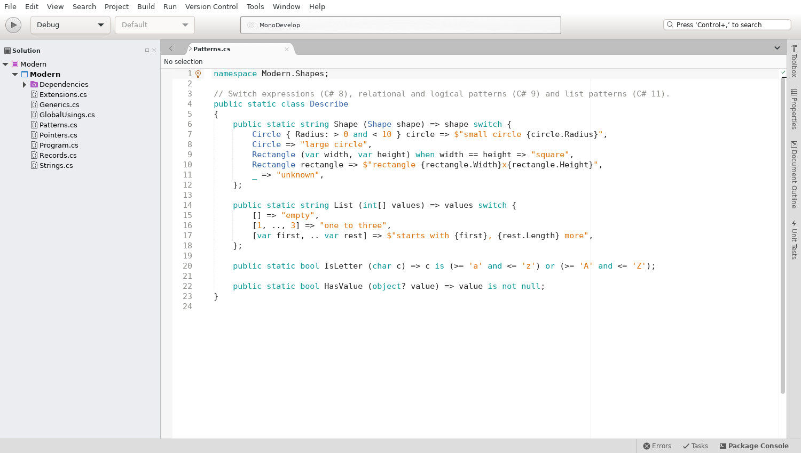

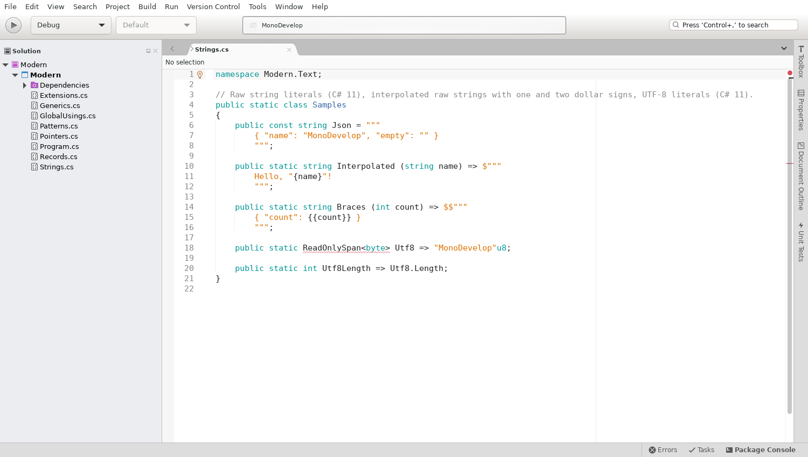

Open: the `ReadOnlySpan` squiggle in `Strings.cs` (and `StringSplitOptions` in `Extensions.cs`) is not a language
version problem. The IDE workspace does not get the SDK's implicit usings (`obj/.../Modern.GlobalUsings.g.cs`, target
`GenerateGlobalUsings`), so types of `System` are unresolved in projects with `<ImplicitUsings>enable</ImplicitUsings>`.

## T146 — implicit usings

A `dotnet new console` project has `<ImplicitUsings>enable</ImplicitUsings>`, and its `Program.cs` uses `Console`
with no `using`. The editor marked it as an error (and `ReadOnlySpan`, `StringSplitOptions` in Modern, the open point
of T138).

**Root cause.** The type system gets the generated source files of a project from a design-time run of the
`CoreCompileDependsOn` targets in the builder. On SDK 10 that is only `_ComputeNonExistentFileProperty` and
`ResolveCodeAnalysisRuleSet`. The SDK writes `obj/<cfg>/<tfm>/<Project>.GlobalUsings.g.cs` in `GenerateGlobalUsings`,
which is hooked with `BeforeTargets="BeforeCompile;CoreCompile"`, like `GenerateAssemblyInfo` and
`GenerateTargetFrameworkMonikerAttribute`. None of them ran, so the workspace had no global usings.

**Fix.** For SDK projects (`UsingMicrosoftNETSdk`), `Project` appends `BeforeCompile` to that design-time run: the
SDK's targets write the files, also in a project that was never built, and return their `Compile` (and
`EditorConfigFiles`) items. `PackageManagementMSBuildExtension` puts its NuGet targets before `BeforeCompile`, and
`SdkProjectExtension` no longer adds the assembly info file a second time. The options and the reasons for this one
are in the amendment of [ADR 0008](../../adr/0008-msbuild-hosting.md).

Tests (dev container, Xvfb), fixture `main/tests/test-projects/implicit-usings` (`dotnet new console`, plus a `Using`
item, a static `Using` and an alias; `Program.cs` has no `using` directive):

- `MonoDevelop.Core.Tests` `GetSourceFilesAsyncTests.SdkProjectIncludesGeneratedGlobalUsingsAndAssemblyInfo`: on the
  never-built project, the source files include `ImplicitUsings.GlobalUsings.g.cs` (with the implicit, static and
  alias usings), the assembly info and the target framework attribute, each once. A `Using` item added and saved
  shows up in the file. Failed before the fix (no generated file). About 1 s.
- `MonoDevelop.Ide.Tests` `TypeSystemServiceTests.ImplicitUsingsProjectHasNoErrorsAsync`: after an offline restore,
  the Roslyn project has the generated document, and `Program.cs` and the whole compilation have 0 errors. Failed
  before the fix. About 3 s.
- Each new test passed 3 times in a row. Core.Tests (1139 passed), DotNetCore.Tests (252), Ide.Tests (862),
  CSharpBinding.Tests (172), PackageManagement.Tests (704) and Ide.Gtk3.Tests (117) pass with
  `Category!=Quarantine`. Core.Tests took 4 min 35 s with the fix and 4 min 37 s without it (same machine).

`--smoke-test` with `MD_SMOKE_OPEN` now also compiles the opened file's project in the IDE's workspace and fails the
run on any error there (it retries for up to 30 s while the workspace reloads the project). `gui-smoke-modern` in
`scripts/ci.sh` checks the line for Modern. On a fresh `dotnet new console` project, restored but never built, before
the fix:

```
Smoke test: Implicit compiles in the workspace with 1 errors, 1 in Program.cs
Smoke test: workspace error <tmp>/Implicit/Program.cs(1,1): error CS0103: The name 'Console' does not exist in the current context
Smoke test: exit code 2 (MD_SMOKE_OPEN: 1 errors in the workspace compilation of Implicit) after 38.4 s
```

After the fix (the screenshot adds `ReadOnlySpan`, `StringSplitOptions`, `List`, LINQ, `Task` and `File` to the
template's `Program.cs`):

```
Smoke test: Program.cs parses as C# 14.0 with 0 syntax errors
Smoke test: Implicit compiles in the workspace with 0 errors, 0 in Program.cs
Smoke test: exit code 0 (loaded (MD_SMOKE_NO_BUILD)) after 11.7 s
```

```bash
dotnet new console -o <tmp>/Implicit
MD_SMOKE_NO_BUILD=1 MD_SMOKE_OPEN=Program.cs MD_SMOKE_OUT=out/smoke-t146 xvfb-run -a -s "-screen 0 1600x1000x24" \
  dotnet main/build/bin/MonoDevelop.dll --smoke-test -no-redirect <tmp>/Implicit/Implicit.csproj
```

The Modern smoke (`gui-smoke-modern`) reports `Modern compiles in the workspace with 0 errors`.

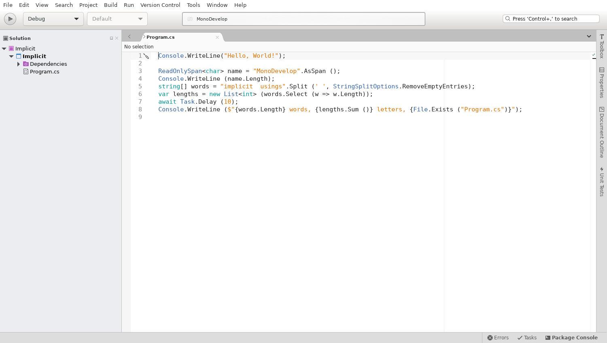

Open: source generators. The generators of the shared framework (`[GeneratedRegex]`, `[LibraryImport]`,
System.Text.Json) come from `ResolveTargetingPackAssets`, which the design-time run does not execute, so a
`[GeneratedRegex]` partial method is still a false error (CS8795) in the editor; `dotnet build` is fine.

## T147 — source generators

A `[GeneratedRegex]` partial method was a false error in the editor (CS8795), and so were a `[LibraryImport]` method
and a `JsonSerializerContext` (CS0534, CS0117), while `dotnet build` compiled them (the open point of T146).

**Root cause.** The generators are `Analyzer` items, and the IDE's Roslyn project gets its analyzer references from
`Project.GetAnalyzerFilesAsync`, the `Analyzer` items of the design-time run of T146
(`<CoreCompileDependsOn>;BeforeCompile`). The generators of the shared framework are added by
`ResolveTargetingPackAssets` (from `Microsoft.NETCore.App.Ref/10.0.12/analyzers/dotnet/cs`), which a build runs for
`ResolveAssemblyReferences` and this run did not: the workspace had only the NetAnalyzers, so no generator ran. The
IDE side was fine: given the generators as `AnalyzerFileReference`s, Roslyn 5.9 loads and runs them and adds their
documents to the compilation.

**Fix.** For SDK projects the design-time run is `<CoreCompileDependsOn>;ResolveLockFileAnalyzers;_HandlePackageFileConflicts;BeforeCompile`:
the analyzers of the targeting pack and of NuGet packages, with the package/targeting-pack conflicts resolved as in a
build (`Project.SdkAnalyzerTargets`; `PackageManagementMSBuildExtension` puts its NuGet targets before them). Nothing is
built. The generators load in Roslyn's `DirectoryLoadContext`s, one per analyzer directory, where
`Microsoft.CodeAnalysis` resolves to the IDE's 5.9 in the default context. Decision and alternatives:
[ADR 0025](../../adr/0025-source-generators-in-the-workspace.md), amendment of [ADR 0008](../../adr/0008-msbuild-hosting.md).

A source-generated document has a virtual, relative path (`<generator assembly>/<generator type>/<hint name>`), which
the editor cannot open. Go to definition, the list of partial declarations and Find References now go through
`SourceGeneratedFiles`, which writes its text to a read-only file under `<cache>/SourceGenerated/<project>-<hash>/`;
the editor opens it read-only. Before, go to definition asked the editor to open the relative path.

Tests (dev container, Xvfb), fixture `main/tests/test-projects/source-generators` (`dotnet new console`, plus
`[GeneratedRegex]`, `[LibraryImport]` with `AllowUnsafeBlocks`, and a `JsonSerializerContext`; `dotnet build` gives 0
warnings and it prints `True {"X":1,"Y":2} True`):

- `MonoDevelop.Core.Tests` `GetAnalyzerFilesAsyncTests.SdkProjectIncludesTargetingPackSourceGenerators`: on the
  never-built project, the analyzer files include the Regex, LibraryImport (and `Microsoft.Interop.SourceGeneration`)
  and System.Text.Json generators of the targeting pack, once each, next to the NetAnalyzers; `bin/` gets no file.
  Failed before the fix (only the two NetAnalyzers). About 1 s.
- `MonoDevelop.Ide.Tests` `TypeSystemServiceTests.SourceGeneratorsProjectHasNoErrorsAsync`: after an offline restore,
  the Roslyn project has the generator references, `GetSourceGeneratedDocumentsAsync` returns `RegexGenerator.g.cs`,
  `LibraryImports.g.cs` and the `PointContext.*.g.cs` files, `Program.cs` and the whole compilation have 0 errors, the
  Regex generator is not in the default load context and there is one `Microsoft.CodeAnalysis`. The implementation of
  the `[GeneratedRegex]` method maps to a read-only `RegexGenerator.g.cs` under the cache directory with the generated
  text. Failed before the fix (no generator reference). About 4 s.
- Each new test passed 3 times in a row.

**Smoke.** `main/tests/linux-smoke/Modern` has `Generators.cs` (a `[GeneratedRegex]` method and a
`JsonSerializerContext`), used by `Program.cs`; `dotnet build`, `mdtool build` and the IDE build give 0 warnings, and it
prints `3 {"Major":10,"Minor":0}`. `--smoke-test` logs the number of source-generated documents and the time of the
first workspace compilation, and `MD_SMOKE_GOTO=<method>` goes to the definition of a generated partial method.
`gui-smoke-modern` requires source-generated documents and the read-only generated file. Without the fix:

```
Smoke test: Modern compiles in the workspace with 5 errors, 0 in Patterns.cs (0 source-generated documents, first compilation 0.1 s)
Smoke test: workspace error <tmp>/Modern/Generators.cs(12,31): error CS8795: Partial method 'Words.Word()' must have an implementation part because it has accessibility modifiers.
Smoke test: workspace error <tmp>/Modern/Generators.cs(20,22): error CS0534: 'ReleaseContext' does not implement inherited abstract member 'JsonSerializerContext.GetTypeInfo(Type)'
Smoke test: exit code 2 (MD_SMOKE_OPEN: 5 errors in the workspace compilation of Modern) after 41.3 s
```

With the fix:

```
Smoke test: Modern compiles in the workspace with 0 errors, 0 in Patterns.cs (6 source-generated documents, first compilation 1.1 s)
Smoke test: go to definition of Word opened RegexGenerator.g.cs at line 20, read-only: True
Smoke test: exit code 0 (success) after 15.1 s
```

**Load time** (same machine, Modern, three runs each without and with the fix):

| | without | with |
|---|---|---|
| design-time run, `dotnet msbuild -clp:PerformanceSummary` (targets of the IDE's run, restored project) | 200–210 ms | 201–208 ms |
| added targets: `ResolveTargetingPackAssets`, `ResolveFrameworkReferences`, `_HandlePackageFileConflicts` | — | 4–5, 6, 3 ms |
| longest main-loop stall while loading (smoke) | 123, 141, 147 ms | 135, 141, 134 ms |
| first workspace compilation of Modern (smoke, background thread) | 0.1–0.2 s | 1.1 s |

The design-time run and the UI are unaffected. The first compilation takes about 1 s more, off the UI thread: loading
and JIT-compiling the generators and running them for the first time.

```bash
MD_SMOKE_OPEN=Modern/Generators.cs MD_SMOKE_OUT=out/smoke-t147 xvfb-run -a -s "-screen 0 1600x1000x24" \
  dotnet main/build/bin/MonoDevelop.dll --smoke-test -no-redirect <copy of linux-smoke>/Modern.sln
```

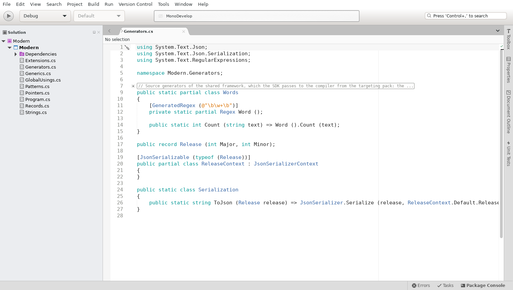

With `MD_SMOKE_GOTO=Word`, the read-only generated file:

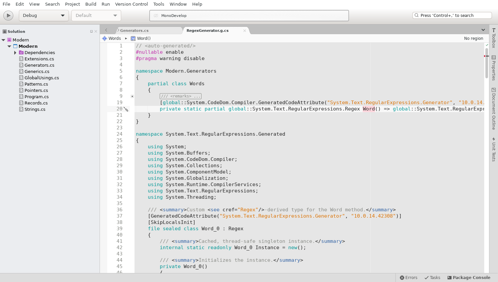

Open:

- analyzers from project references (`ProjectReference` with `OutputItemType="Analyzer"`, a generator in the same
  solution) come from `ResolveProjectReferences` and are not collected;
- generator reruns while typing follow Roslyn's defaults and were not measured on large projects; generator load
  contexts are not collectible, so a generator changed on disk is used after an IDE restart;
- the generated file opened by navigation is a snapshot with grammar highlighting only; generated documents are not
  listed under the project's Dependencies node.

## T109 — M5c evidence (2026-09-24)

**Smoke tests.** The runs below come from the green `scripts/ci.sh` run of 2026-09-24 (515 s of the 900 s budget).
Every `--smoke-test` run uses a fresh profile, so the MEF and add-in caches are cold.

| Step | Display | Main window after process start | Longest main-loop stall while loading | Result |
|---|---|---|---|---|
| `gui-smoke` (Smoke.sln: Hello + Greeter) | X11 (Xvfb) | 2.2 s | 135 ms | build 0 errors, exit 0 |
| `wayland-smoke` (same solution) | Wayland (headless Weston) | 1.7 s | 159 ms | build 0 errors, exit 0 |
| `gui-smoke-errors` (Broken) | X11 | 2.4 s | 246 ms | 1 build error, navigation to Program.cs:2, exit 1 (expected) |
| `gui-smoke-modern` (Modern, C# 14, source generators) | X11 | 2.3 s | 208 ms | build 0 errors, 0 workspace errors, exit 0 |

The start-up time is far below the 10 s target (NFR-001; the M8 measurement in T129 repeats it on the reference
machine). The stall probe of T106 now also covers C# projects: the longest main-loop pause is 246 ms while the
workspace loads.

Screenshots: X11 [T109-smoke-x11.png](T109-smoke-x11.png), Wayland [T104-smoke-wayland.png](T104-smoke-wayland.png).

**Wayland screenshot fixed.** The Wayland screenshot committed with T104 was blank. `gdk_pixbuf_get_from_window`
cannot read window contents back on Wayland: the IDE ran, but the image showed nothing. On Wayland the smoke test now
has the main window draw itself into a Cairo image surface. `scripts/ci.sh` also rejects a uniform screenshot:
the grey-level standard deviation must be above 0.02. The blank image scored 0, X11 scores 0.066, and the new
Wayland image scores 0.193.

**GTK 2 APIs (ADR 0011 metric 1): 0 in compiled code.** Over the 5,512 C# files compiled by the Linux solution
(`scripts/tools/compiled-files.sh`), the ADR 0011 patterns match 18 files:
- MonoDevelop's own files: only comments that describe what was ported.
- The vendored Xwt: code inside `#if !XWT_GTK3` or the `#else` branch of `#if XWT_GTK3` (not compiled in
  `Xwt.Gtk3.csproj`).
- Xwt's own GTK 3 `OnSizeRequested (ref Gtk.Requisition)` virtuals (`Gtk3DrawingArea`, `Gtk3ViewPort`,
  `HeaderBoxGtk3` and their overrides). Upstream Xwt defines these on top of `GetPreferredWidth/Height`; they are
  not GTK 2 API.

**Port helpers (ADR 0011 metric 2): 344 uses in 93 files, not 0.** Counts:

| Helper | Uses |
|---|---|
| `Gtk3SizeRequest` | 150 |
| `Gtk3ExposeEvent` | 79 |
| `Gtk3BaseSizeRequest` | 68 |
| `Gtk3BaseGetSize` | 31 |
| `Gtk3CompatExtensions` | 16 |

Replacing them means rewriting the size negotiation and drawing of 93 widgets in native GTK 3 form. That carries a
high risk of visual regressions and brings no user-visible gain now. The ADR 0011 amendment of 2026-09-24 therefore
moves this metric from the M5c exit criteria to task T150, where it is tracked until it reaches 0.

## T153 — debugger pads

**Symptom.** In the debug smoke test (`MD_SMOKE_DEBUG=1`), the IDE debugs Hello from Smoke.sln with netcoredbg to a
breakpoint on the first line of Program.cs. Within a second of the Debug layout opening the Locals and Watch pads, one
of two things happened:

- the IDE crashed with a segmentation fault, before the debugger stopped;
- GObject logged `g_object_remove_toggle_ref: assertion 'G_IS_OBJECT (object)' failed` (from
  `GLib.ToggleRef.PerformQueuedUnrefs`) or `g_object_unref: assertion 'G_IS_OBJECT (object)' failed` (from the main
  loop).

After a critical the smoke test still exited with 0.

**Root cause.** The fault was not in the pads. With `MD_GTK_REFERENCE_DIAGNOSTICS=1` and temporary logging of every
instance whose last reference was released through GtkSharp's finalizer queue, the failing runs showed two GdkX11Windows
of the source editor being freed that way. One was the window that `Mono.TextEditor.TextArea.OnRealized` creates with
`new Gdk.Window (...)`. Both were already destroyed, and no repair was logged.

ADR 0024 explains why the wrapper made by the `Gdk.Window` constructor holds GDK's own reference: its toggle reference is
not counted. Its repair runs when GDK drops that reference, and it needs the wrapper to be alive at that moment. But
TextArea keeps no reference to the wrapper. Because the wrapper's toggle reference is the only one counted, GtkSharp
holds the wrapper weakly, and the garbage collections at the start of a debug session collect it. The Debug layout also
moves the editor, which unrealizes and realizes it again. Releasing the collected wrapper's toggle reference therefore
drops a reference that GDK or a second wrapper still counts on (`Gtk.Widget.Window` makes a new wrapper once the first
is gone). The window is freed while it is still used, and the next unref hits freed memory.

`ToplevelReferenceTests` reproduces this without the debugger: a realized custom widget whose GdkWindow wrapper is
collected, in a toplevel and in an offscreen window, with and without a second wrapper. Before the fix these tests
failed and crashed the test host. For the offscreen window, this is the "losing last reference to undestroyed window"
of T144.

**Fix.** Three changes:

- GdkWindows get a floating reference when they are constructed; the first wrapper, made by the constructor or by
  `GetObject`, sinks it, so its toggle reference is counted (ADR 0024 amendment).
- `DockContainer` no longer destroys its window before GTK does. GTK then released the window a second time.
- The smoke test exits with 2 when a critical of the `GLib-GObject` domain is logged, and while stopped it brings the
  Locals pad to the front.

The four existing GUI smokes (`gui-smoke`, `gui-smoke-errors`, `gui-smoke-modern`, `wayland-smoke`) log no
GLib-GObject critical, so the rule covers the whole domain. The Wayland run's `Gdk` criticals for its missing seat are
not affected.

**Failure rate** (debug smoke, Xvfb, fresh profile per run, 2026-09-24):

| Build | Runs | Segfault | GLib-GObject critical | Clean |
|---|---|---|---|---|
| before (HEAD e5157bc80e) | 10 | 2 | 4 (exit code 0) | 4 |
| before, with the smoke test failing on criticals | 5 | 2 | 3 (exit code 2) | 0 |
| after | 10 | 0 | 0 | 10 |
| after, `gui-smoke-debug` CI step (Breakpoints pad in front) | 20 in a row | 0 | 0 | 20 |
| after, final `gui-smoke-debug` (Locals pad in front) | 20 in a row | 0 | 0 | 20 |

Before the fix, 11 of 15 runs failed; after it, 0 of 50. The new CI step `gui-smoke-debug` takes 15 to 22 s. It
expects exit code 0 and the log line `the debugger stopped at the breakpoint Program.cs:1`.

The IDE stopped at the breakpoint, with the Locals pad showing `args`:

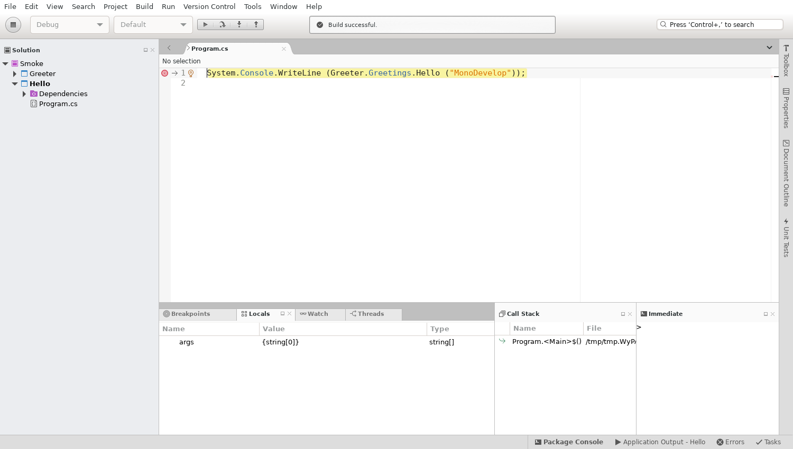

Open: T144 needs its 50-run check of `MonoDevelop.Ide.Gtk3.Tests` to confirm that this was its cause. Toplevels keep
the dispose-time repair of ADR 0024: a toplevel wrapper collected while its window is shown is still not covered, but
the IDE keeps its toplevels in fields and no failure was seen.

## T152 — templates from dotnet new

The New Project and New File dialogs list the templates of `dotnet new` and create projects, solutions and files by
running the CLI ([ADR 0026](../../adr/0026-dotnet-new-templates.md)). `DotNetNewTemplateCatalog` reads the template
packages that the CLI uses with Microsoft.TemplateEngine, off the UI thread. For SDK 10.0.401 that is 7 packages
from `dotnet/templates/10.0.12`, with no workload packs and no installed packages: 53 templates in 90–500 ms. The
result is cached in `<cache>/DotNetNewTemplates/10.0.401.json` (read in 4–10 ms). `DotNetNewTemplateClassifier`
decides what the dialogs show:

- Languages: C# and F# only, C# first.
- Platform: Linux only. Tags `WinForms`/`WPF`/`WinUI`/`UWP` or an `os` constraint without Linux hide a template;
  the deny list is `webconfig`.
- Categories: the first segment of the tags.

Counts for SDK 10.0.401 (`DotNetNewTemplateTests.CountsPerCategory` on the `dotnet new list --columns-all` fixture,
47 rows; `EngineListsWhatTheCliListsAsync` on the 53 templates read in process, which include the 6 items that
`dotnet new list` shows only with a project):

| Dialog | Category | Shown | Hidden (why) |
|---|---|---|---|
| New Project | Common | 4: Class Library, Console App, MCP Server App (`Common/AI/MCP`), Worker Service | 7 Windows only: `winforms`, `winformslib`, `winformscontrollib`, `wpf`, `wpflib`, `wpfcustomcontrollib`, `wpfusercontrollib` |
| New Project | Web | 9: `web`, `grpc`, `webapi`, `webapiaot`, `mvc`, `webapp`, `blazor`, `blazorwasm`, `razorclasslib` | 0 |
| New Project | Test | 5: `mstest`, `mstest-playwright`, `nunit`, `nunit-playwright`, `xunit` | 0 |
| New Project | Solution | 1: `sln` (written with `--format sln`) | `slnf` not offered: a solution filter needs an existing solution |
| New File | Common | 5 for C# projects: `class`, `enum`, `interface`, `record`, `struct` (`project-capability` CSharp) | 1 unsupported language: `module` (VB only) |
| New File | Web | 8: `apicontroller`, `mvccontroller`, `viewimports`, `viewstart`, `proto`, `razorcomponent`, `page`, `view` | 0 |
| New File | Test | 2: `mstest-class`, `nunit-test` | 0 |
| New File | Config | 6: `gitattributes`, `gitignore`, `tool-manifest`, `editorconfig`, `globaljson`, `nugetconfig` | 1 Windows only: `webconfig` (IIS) |
| New File | MSBuild | 3: `buildprops`, `buildtargets`, `packagesprops` | 0 |

In total there are 44 visible templates: 18 project templates, 2 solution templates (only `sln` is offered) and 24
item templates. 9 are hidden: 8 Windows-only and 1 VB-only. The Visual Basic variants of 11 templates are dropped
(`console`, `classlib`, `mstest`, `mstest-class`, `nunit`, `nunit-test`, `xunit`, `class`, `enum`, `interface`,
`struct`). F# is offered by 11: `console`, `classlib`, `worker`, `web`, `webapi`, `mvc`, `mstest`, `mstest-class`,
`nunit`, `nunit-test`, `xunit`.

Commands (dev container):

```bash
./scripts/pm bash -lc 'xvfb-run -a dotnet test main/tests/MonoDevelop.Ide.Gtk3.Tests/MonoDevelop.Ide.Gtk3.Tests.csproj \
  --filter "FullyQualifiedName~DotNetNewTemplateTests"'
./scripts/pm bash -lc 'xvfb-run -a dotnet test main/tests/Ide.Tests/MonoDevelop.Ide.Tests.csproj \
  --settings main/tests/Ide.Tests/obj/monodevelop.runsettings --filter "FullyQualifiedName~DotNetNewTemplatingTests"'
```

Tests:

- `DotNetNewTemplateTests` (MonoDevelop.Ide.Gtk3.Tests, 19): the rules on the fixture
  (`TestData/dotnet-new-list-10.0.401.txt`), future templates (WinUI tag, `os` constraint, VB only, no tags), the
  parser, the CLI arguments, `packages.json`, the per-SDK cache and CLI errors. They also check that the engine lists
  the same short names, languages, tags and classification as `dotnet new list --ignore-constraints`, and as
  `dotnet new list` once the templates that need a project are removed.
- `DotNetNewTemplatingTests` (MonoDevelop.Ide.Tests, 5):
  - the categories of the templating service (.NET → Common, Web, Test, Solution; no WinForms/WPF; C# and F# only);
  - for C# and for F#, a new solution with a console project (`dotnet new console`, `dotnet new sln --format sln`,
    `dotnet sln add`, `Program.cs`/`Program.fs` opened), then a class library added to it the way the dialog does,
    with `dotnet sln list` showing both;
  - a blank `.sln`;
  - the items `gitignore` (fixed name), `nunit-test` and `class`, created in a C# project that then includes them.
- `NewProjectDialogTests` select `Microsoft.Common.Library.CSharp` instead of the removed XML library template.

Screenshots, taken by the smoke test with `MD_SMOKE_NEW_PROJECT=1 MD_SMOKE_NEW_FILE=1 MD_SMOKE_NO_BUILD=1` (off by
default) on `main/tests/linux-smoke/Smoke.sln`:

```
Smoke test: New Project dialog categories: Common, Web, Test, Solution; selected Console App (C#, F#)
Smoke test: saved new-project.png
Smoke test: New File dialog shown for Hello
Smoke test: saved new-file.png
```

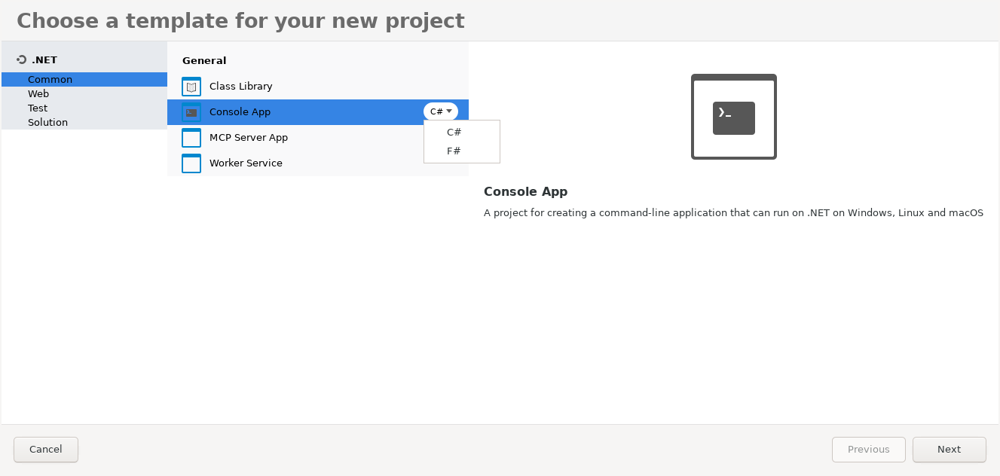

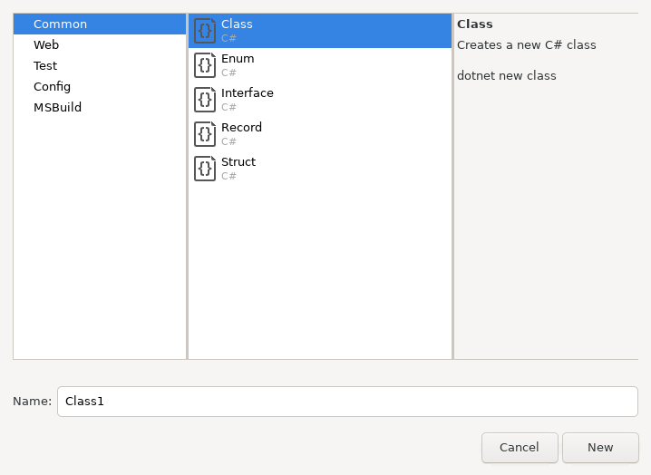
