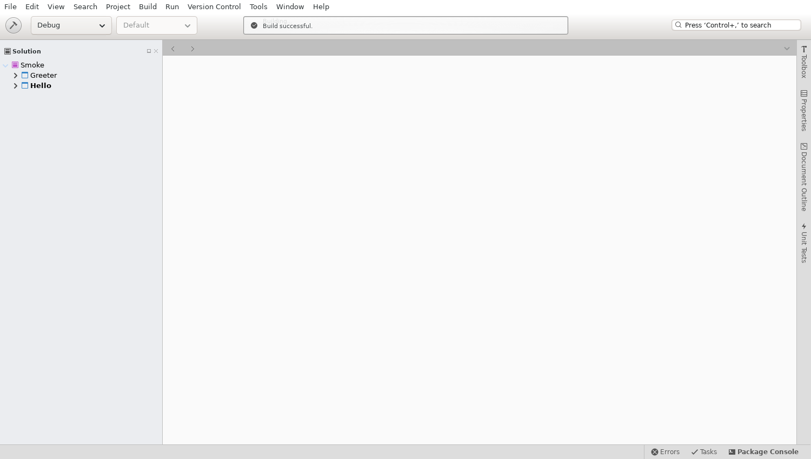

# M7 evidence — Flatpak (US5, FR-013, SC-008)

Decision record: [ADR 0022](../../adr/0022-flatpak.md). Date: 2026-09-24, commit base `980c69061b`
(+ M7 changes), maintainer workstation (x86-64, rootless podman).

## T121 — packaging container

```bash
PM_PROFILE=flatpak ./scripts/pm flatpak --version     # Flatpak 1.14.6
```

Image `localhost/md-flatpak:<hash>` from `packaging/flatpak/Containerfile` (same pinned .NET SDK
10.0.401 base as the dev image; flatpak 1.14.6, flatpak-builder 1.4.2, bubblewrap 0.9.0, AppStream
1.0.2). Extra podman option found by elimination: `--security-opt unmask=/proc/*` only.

| podman options (besides the default profile's) | `flatpak run` of a GNOME 51 sandbox |
|---|---|
| `--cap-add SYS_ADMIN` + others | fails: `bwrap: Unexpected capabilities but not setuid` |
| none | fails: `bwrap: Can't mount proc on /newroot/proc` |
| `--security-opt seccomp=unconfined` | fails: same |
| `--security-opt unmask=ALL` | works |
| `--security-opt unmask=/proc/*` | works (chosen) |

`/dev/fuse` is not needed (`flatpak-builder --disable-rofiles-fuse`). Runtimes and state are in the
`md-flatpak` volume; the host's flatpak installation was not used.

## T122 — manifest and desktop files

`packaging/flatpak/io.github.viniciusmorgado.MonoDevelop.{yml,desktop,metainfo.xml,xml}`,
`packaging/flatpak/monodevelop.sh` (installed as `monodevelop` and `mdtool`).

| Validator | Result |
|---|---|
| `desktop-file-validate` (source and exported entry) | pass, no output |
| `appstreamcli validate --no-net` (source, build dir, installed export) | `Validation was successful: pedantic: 1` (`cid-contains-uppercase-letter`: the app id contains `MonoDevelop`; pedantic only, accepted by Flathub) |
| `appstreamcli compose` (run by flatpak-builder) | pass |
| `flatpak-builder-lint` (org.flatpak.Builder from Flathub) — manifest | `finish-args-home-filesystem-access` |
| `flatpak-builder-lint` — build dir / repo | `finish-args-home-filesystem-access`, `appstream-missing-screenshots` (screenshot URLs on the default branch are not reachable yet), repo also `appstream-screenshots-not-mirrored-in-ostree` (Flathub's build infrastructure mirrors them) |

The remaining lint errors are Flathub submission rules, not packaging defects: home access is
deliberate (ADR 0022, needs a Flathub exception) and the screenshots resolve once `docs/evidence/M5`
is on the default branch.

## T123 — `scripts/package-flatpak.sh`

```bash
PM_PODMAN_ARGS="-e ContinuousIntegrationBuild=true" ./scripts/pm ./scripts/build.sh -c Release   # 1 min 32 s, 0 errors
PM_PROFILE=flatpak ./scripts/pm ./scripts/package-flatpak.sh                                   # 3 min 19 s
```

`ContinuousIntegrationBuild=true` (as in CI) maps source and PDB paths to `/_/`, so no shipped file
carries the path of the checkout; `package-flatpak.sh` checks this and refuses the bundle otherwise
(a first local build without it embedded the checkout path in 120 assemblies and PDBs).

Timings ([T123-timings.txt](T123-timings.txt)): validate 0 s, flatpak-builder 41 s, `build-bundle`
153 s (xz), SBOM 4 s, total 199 s (runtimes already cached in the volume; the first install of GNOME
51 Sdk/Platform and the .NET extension takes about 3 GB in the volume).

| Output | Value |
|---|---|
| `out/monodevelop.flatpak` | 148 MB (154 454 880 bytes) |
| `out/monodevelop.flatpak.sha256` | `446518c04f24a01587cf75d2ea14bc5c1d847fc41383447fb4affe396e6103f3` |
| `out/monodevelop.cdx.json` | CycloneDX 1.7, 116 KB, 84 components: 83 NuGet packages of the shipped projects (e.g. GtkSharp 3.24.24.95, LibGit2Sharp 0.32.0, Microsoft.CodeAnalysis.* 5.9.0; tests and development-only packages excluded) + `dotnet-sdk` 10.0.401 |
| app in the build dir | 704 MB (`/app/lib/dotnet` SDK 624 MB, `/app/lib/monodevelop` 80 MB after dropping non-Linux `runtimes/`) |

The checksum changes on every build (the OSTree commit carries a timestamp).

## T124 — install test in a clean installation

```bash
PM_PROFILE=flatpak ./scripts/pm ./scripts/test-flatpak.sh    # 1 min 20 s
```

A fresh flatpak user installation (`/var/lib/md-flatpak/test-user`, wiped first, as is
`~/.var/app/io.github.viniciusmorgado.MonoDevelop`) in a new container. Results
([T124-summary.txt](T124-summary.txt)):

| Step | Exit | Time | Check |
|---|---|---|---|
| checksum | 0 | 0 s | `sha256sum -c out/monodevelop.flatpak.sha256` |
| install | 0 | 59 s | `flatpak install --user out/monodevelop.flatpak`: GNOME 51 runtime (+ locale, GL, codecs extensions) fetched from Flathub through the bundle's `--runtime-repo`; app installed 724 MB |
| desktop | 0 | 0 s | exported desktop entry validates (`Exec=/usr/bin/flatpak run … --command=monodevelop --file-forwarding io.github.viniciusmorgado.MonoDevelop @@ %F @@`), icons 128/512 px, MIME package, metainfo |
| version | 0 | 1 s | `flatpak run io.github.viniciusmorgado.MonoDevelop --version` → `MonoDevelop 8.6 Preview (8.6, .NET 10.0.12)`; `dotnet --list-sdks` in the sandbox → `10.0.401 [/app/lib/dotnet/sdk]` |
| mdtool-build | 0 | 6 s | `flatpak run --command=mdtool … build <copy>/Hello/Hello.csproj` → `Build succeeded. 0 Warning(s) 0 Error(s)`; the built `Hello.dll` run with the sandbox's `dotnet` prints `Hello, MonoDevelop!` |
| ide-smoke | 0 | 14 s | `xvfb-run flatpak run … --smoke-test -no-redirect <copy>/Smoke.sln`: main window 4.3 s after start, `loaded Smoke (2 projects)`, `build finished with 0 errors, 0 warnings`, `exit code 0 (success)`; no "Error loading icon" in the log |



Also checked in the installed sandbox: every soname of `NativeLibraryMap` (GTK 3, GDK, GLib, GObject,
GIO, Pango, PangoCairo, Cairo, gdk-pixbuf, ATK, libc) is in the GNOME 51 runtime; LibGit2Sharp's
`libgit2-5853918.so` has no missing dependency (`ldd`); only `linux-x64` native assets remain; the
SDK's workload install mode is user-local (`metadata/workloads/10.0.400/userlocal`, `dotnet workload
list` runs).

Findings fixed on the way:

- The extension's `install-sdk.sh` omits `packs/` (targeting packs); the manifest copies the whole SDK.
- GNOME 51 loads images in a sandboxed glycin process through the Flatpak portal. The first test run
  had no portal-capable D-Bus session in the container: every icon failed and the smoke test timed out
  (exit 2), which the first version of the test script did not report. The script now exports the
  bus addresses to D-Bus activation and fails on any icon error; its steps run with errexit.
- `theme-icons/GNOME/monodevelop.svg` is not readable by `appstreamcli compose` in the container and is
  a 48 px design: PNG icons only.

Log noise not caused by the package: `addins.monodevelop.com` (the retired add-in repository) does not
resolve, and one Roslyn MEF export (`PythiaSignatureHelpProvider`) is reported as info, as outside the
Flatpak.

## Not verified here

- A desktop session (Wayland/X11 with a real portal) and the application-menu entry on a host: the
  bundle was not installed on the host's flatpak installation (by rule).
- The `release.yml` Package step (`PM_PROFILE=flatpak`) on a GitHub runner: needs a push.
- arm64.
